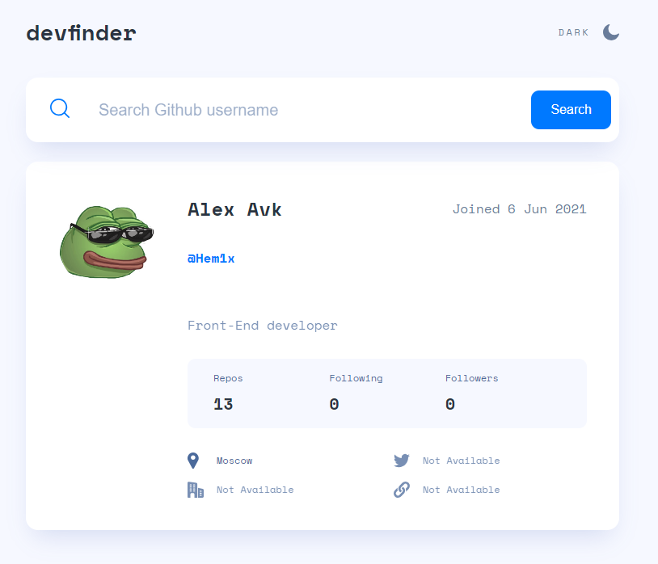

# github-profies

Веб-приложение для поиска информации о github-пользователе.

## Демо



## Технологии


## Запуск проекта

Для запуска проекта необходимо выполнить следующие действия:

1. Склонировать проект на ваш компьютер с [Github](https://github.com/Hem1x/github-profies) с помощью команды:

```
git clone git@github.com:Hem1x/github-profies.git
```

2. Установить зависимости:

```
npm install
```

3. Запустить проект:

```
npm start
```

## Ссылка на проект
